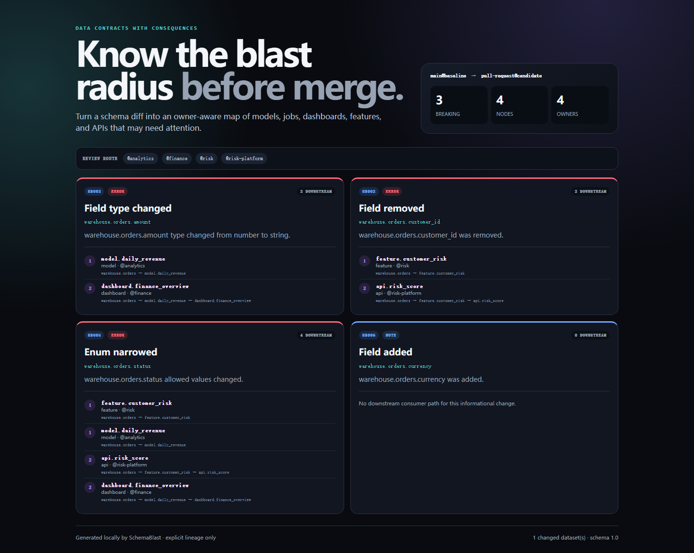

<div align="center">

# SchemaBlast

**Data contracts with consequences.**

Turn a schema diff into an owner-aware blast radius across models, jobs,
dashboards, APIs, features, and reports — before the pull request merges.

[](https://github.com/RRXXZZYY/schemablast/actions/workflows/ci.yml)
[](https://github.com/RRXXZZYY/schemablast/actions/workflows/codeql.yml)
[](LICENSE)
[](https://docs.oasis-open.org/sarif/sarif/v2.1.0/)

</div>



## See the blast radius in ten seconds

```bash
npx --yes github:RRXXZZYY/schemablast demo --out schemablast-demo.html
```

Open `schemablast-demo.html`. It uses synthetic contracts, is completely
self-contained, and makes no network requests.

## The problem

A schema checker can tell you that `orders.customer_id` disappeared. It usually
cannot answer the questions that decide whether a pull request is safe:

- Does any consumer actually read that field?
- Which downstream model, feature, dashboard, or API is reachable?
- Is the impact direct or several transformations away?
- Which teams need to review the migration?

SchemaBlast combines deterministic compatibility rules with explicit,
field-aware lineage. Every breaking finding carries shortest evidence paths and
an owner route.

## Try the bundled example

```bash
schemablast diff examples/before.snapshot.json examples/after.snapshot.json
schemablast diff examples/before.snapshot.json examples/after.snapshot.json \
  --format html --out blast-radius.html --strict
```

```text
[x] SB003 Field type changed · warehouse.orders.amount
    blast: 2 node(s)
    ↳ warehouse.orders → model.daily_revenue · @analytics
    ↳ warehouse.orders → model.daily_revenue → dashboard.finance_overview · @finance
```

The same demo intentionally proves field filtering: `job.order_archive` reads
only `created_at`, so changes to `amount`, `customer_id`, and `status` do not
route to it.

## Compatibility rules

| Rule | Change | Default |
|---|---|---|
| `SB001` | dataset removed | error |
| `SB002` | field removed | error |
| `SB003` | field type changed; `integer → number` is a widening | error / note |
| `SB004` | non-nullable → nullable; reverse is informational | error / note |
| `SB005` | enum narrowed; widening is informational | error / note |
| `SB006` | field added | note |
| `SB007` | dataset added | note |
| `SB008` | dataset owner changed | note |
| `SB009` | primary key changed | error |

The rules assume a **consumer compatibility** perspective: downstream readers
must continue to understand values produced by the dataset. They do not claim
producer-input compatibility or database migration safety. See [the rule
reference](docs/rules.md).

## Snapshot format

```json
{
  "schemaVersion": "1.0",
  "name": "main@abc123",
  "nodes": [
    {
      "id": "warehouse.orders",
      "kind": "dataset",
      "owner": "checkout",
      "primaryKey": ["id"],
      "fields": {
        "id": { "type": "string", "nullable": false },
        "amount": { "type": "number", "nullable": false }
      }
    },
    { "id": "dashboard.revenue", "kind": "dashboard", "owner": "finance" }
  ],
  "edges": [
    { "from": "warehouse.orders", "to": "dashboard.revenue", "fields": ["amount"] }
  ]
}
```

Node kinds are `dataset`, `model`, `job`, `dashboard`, `api`, `feature`, and
`report`. An edge's optional `fields` list filters only the first hop from a
changed dataset. Later hops conservatively propagate because the snapshot does
not pretend to understand transformation semantics.

Read the complete [snapshot specification](docs/snapshot-format.md).

## GitHub Action

```yaml
name: Data contract check
on: [pull_request]

jobs:
  contracts:
    runs-on: ubuntu-latest
    steps:
      - uses: actions/checkout@v7
      - uses: RRXXZZYY/schemablast@v0.1.0
        with:
          before: contracts/baseline.snapshot.json
          after: contracts/current.snapshot.json
          strict: true
```

Set `format: sarif` and `out: schemablast.sarif` for code scanning, or
`format: html` for a review artifact.

## Commands

```text
schemablast diff <before.json> <after.json> [--format pretty|json|html|sarif]
schemablast validate <snapshot.json>
schemablast demo [--out schemablast-demo.html]

--strict     exit 1 on errors or warnings
--out FILE   write the selected report
```

## Honest boundaries

- Lineage is explicit input; SchemaBlast does not infer SQL lineage in 0.1.
- A reachable node is potentially affected, not proven broken.
- Only the first lineage hop has column-level filtering. Downstream propagation
  is conservative and clearly shows its path.
- Contract type names are strings. Only the documented `integer → number`
  widening has built-in semantics.
- Snapshot comparison does not execute migrations, queries, or transforms.

## Safety and scale

- Zero runtime dependencies, telemetry, and network requests.
- Maximum 10 MiB, 5,000 nodes, 10,000 edges, and 100,000 fields per snapshot.
- Unknown node references, duplicate IDs/edges, malformed primary keys, and
  control characters are rejected before traversal.
- Cycles are safe: each node is visited once per finding and only a shortest
  evidence path is retained.
- HTML escapes snapshot-controlled strings and uses no remote assets.

See [architecture](docs/architecture.md) and [positioning](docs/positioning.md).

## Development

```bash
npm ci
npm test
npm run test:coverage
npm run pack:check
```

Node.js 20 or newer is required. Contributions are welcome under the [MIT
license](LICENSE).
